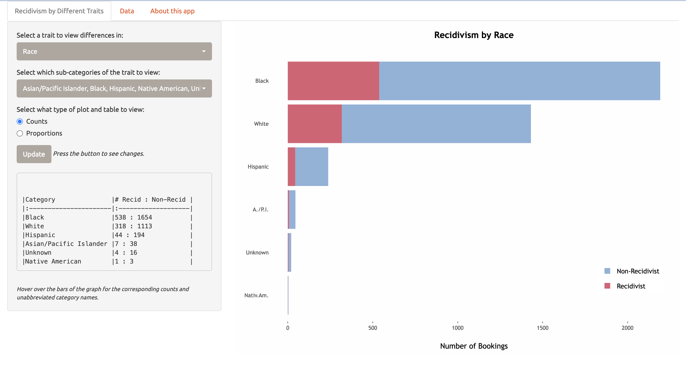

# recidivism_app
This Shiny app was built as a part of the final project for Statistical Data Management (STAT 440), taken at the University of Illinois at Urbana-Champaign.

## Shiny interface
The interactive Shiny app can be found via this [link](https://katiejchai.shinyapps.io/recidivism_app/). A screenshot of the initial interface is shown below.

